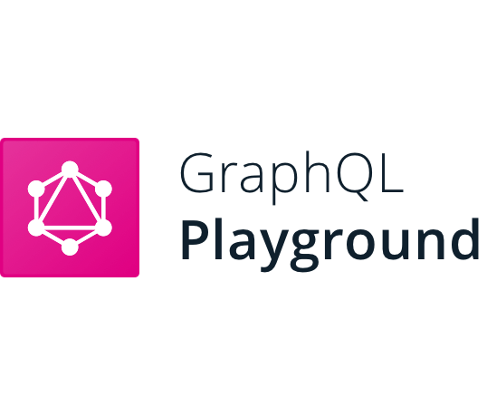
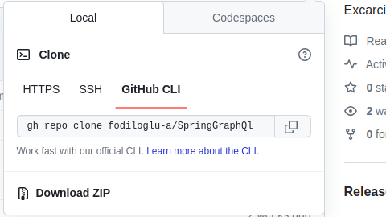
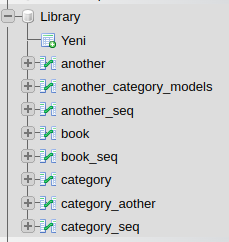
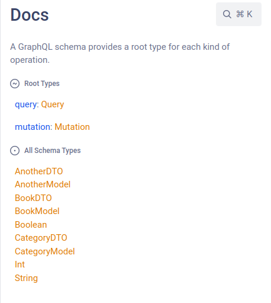
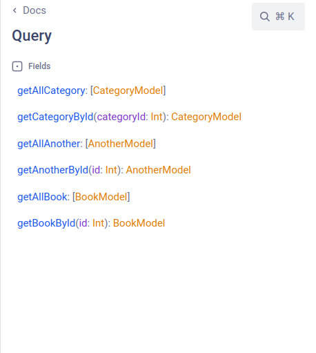
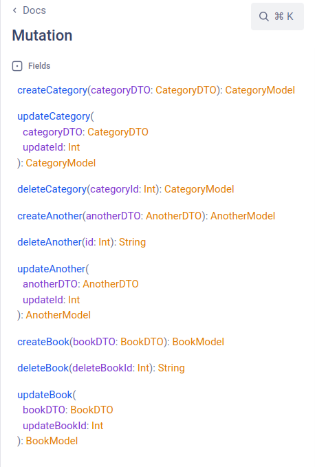
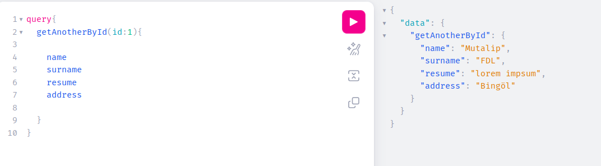
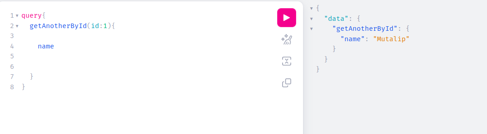

# GraphQl Example Library Project

- Bu proje graphQl öğrenirken geliştirdiğim basit bir projedir.
- Proje temel olarak üç entity den oluşmaktadır.(CategoryModek, BookModel ,AnotherModel).

## GraphQl Nedir?

- GraphQl genel olarak bakıldığı zaman bir API dir. Her API nin yapması gereken client   
  gelen request işler ve ona bir response dönderir.
- Tabi ki diğer API  responslarına göre farkları vardır.Bunlar
---
- Normal bir response kullanıcıya ait tüm bilgileri döndermek zorundadır.
- Örneğin:
- RestFull
getUserById{
     name,surname,address,locations,birthDay,age,nicName ...... 
}
- GraphQl
getUserById{
name,surname
}
 eğer ister isek geriye kalan bu değişkenleri de responsa ekleyebiliriz:(address,locations,birthDay,age,nicName)
---
- GraphQl kısacası responsta döneceğimiz verileri istediğimiz gibi sınırlandırmamıza ve 
farklı tablolardan veri çekmemize olanak tanır bir kaç Rest işlemini tek seferde yaomamızı sağlar.
 ---

## Kurulum

- Proje kurulumu için isterseniz görselde bulunan alandan git clone işlemi yabilirsiniz...
- --

## Kullanım

- Projenin nasıl kullanılacağını gösteren örnekler veya açıklamalar ekleyin.
- ---
- Sahip olmanız gereken özellikler
- Java17 / SpringBoot /MySql /IntellijIDEA
---
## Proje ile İlgili görseller
---

- MySql de DB adı ve oluşan tablolar....

---

- GraphQl de  [graphiQl](https://localhost:8080/graphiql) adresine giderseniz sizi bu şekilde bir document karşılar.

---

- Eğer get işlemi yapacaksanız GraphQl de Query methodunu kullanmanız gerekir.

---

- Eğer Post Delet Put işlemleri yapacaksanız Mutations Resolver Kullanmanız gerekir.

---

--

